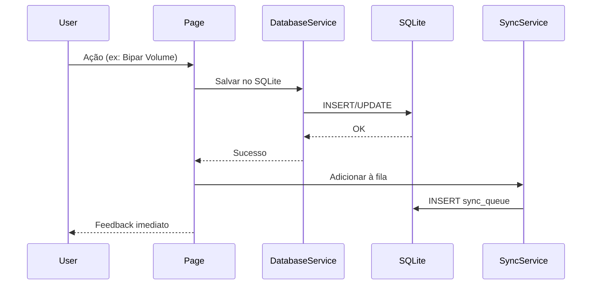
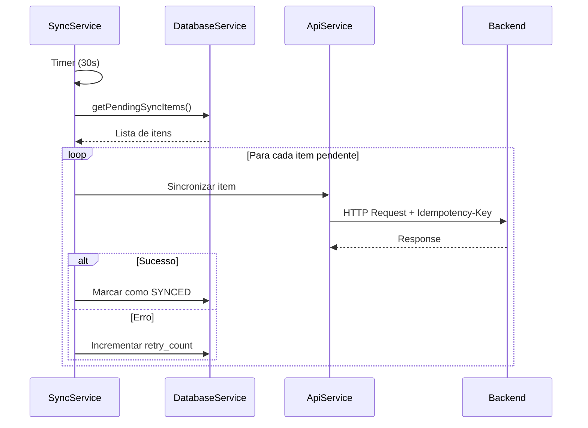
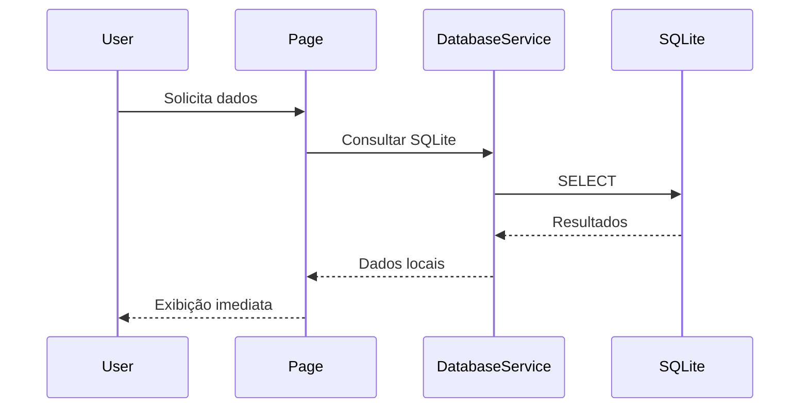

# Arquitetura Offline-First - App Controle CDL

Este documento explica a arquitetura Offline-First implementada no aplicativo, detalhando estratégias, componentes e fluxos de dados.

## 📐 Visão Geral

O App Controle CDL foi projetado com uma arquitetura **Offline-First**, onde todas as operações funcionam primariamente sem conectividade, sincronizando com o backend quando possível.

### Princípios

1. **Local-First**: Todas operações salvam primeiro no SQLite local
2. **Sincronização Assíncrona**: Dados são enviados ao servidor em background
3. **Idempotência**: Operações críticas usam X-Idempotency-Key para evitar duplicação
4. **Resiliência**: Fila de sincronização com retries exponenciais
5. **Transparência**: Indicadores visuais claros do estado de sincronização

## 🏗️ Camadas da Arquitetura

```
┌─────────────────────────────────────────┐
│         Camada de Apresentação          │
│  (Ionic Components + Angular Pages)    │
└─────────────────────────────────────────┘
                   ↕️
┌─────────────────────────────────────────┐
│        Camada de Serviços Core          │
│  DatabaseService │ SyncService          │
│  ApiService      │ ContextService       │
└─────────────────────────────────────────┘
                   ↕️
┌─────────────────────────────────────────┐
│       Camada de Persistência Local      │
│         SQLite (cordova-sqlite)         │
│  romaneios │ volumes │ sync_queue │     │
│  audit_log                              │
└─────────────────────────────────────────┘
                   ↕️
┌─────────────────────────────────────────┐
│      Camada de Sincronização (Cloud)    │
│        API Protheus (Backend)           │
└─────────────────────────────────────────┘
```

## 🔄 Fluxo de Dados Offline-First

### 1. Operação Local (Escrita)



**Exemplo Prático:**
```typescript
// 1. Salvar volume localmente
await this.databaseService.addVolume({
  codigo_barras: 'VOL001',
  id_romaneio: 123,
  status: 'EM_CARGA',
  // ... outros campos
});

// 2. Adicionar à fila de sincronização
await this.syncService.addToSyncQueue(
  'ADD_VOLUME',
  '/romaneios/123/volumes',
  { codigoBarras: 'VOL001', ... }
);

// 3. Feedback imediato ao usuário
this.showToast('Volume adicionado!', 'success');
```

### 2. Sincronização Background



**Implementação:**
```typescript
// SyncService - Loop automático
interval(30000).subscribe(() => {
  if (this.isOnline && !this.isProcessingSyncQueue) {
    this.processSyncQueue();
  }
});

// Processar fila
async processSyncQueue() {
  const items = await this.db.getPendingSyncItems();
  
  for (const item of items) {
    try {
      await this.syncItem(item);
      await this.db.updateSyncItemStatus(item.id, 'SYNCED');
    } catch (error) {
      const retryCount = item.retry_count + 1;
      if (retryCount < MAX_RETRIES) {
        await this.db.updateSyncItemStatus(item.id, 'PENDING');
      } else {
        await this.db.updateSyncItemStatus(item.id, 'ERROR', error.message);
      }
    }
  }
}
```

### 3. Operação Local (Leitura)



## 🗄️ DatabaseService - Abstração SQLite

O `DatabaseService` abstrai completamente o acesso ao SQLite, com suporte a:

### Mock Mode (Desenvolvimento Web)
```typescript
if (window.cordova && window.sqlitePlugin) {
  // Usar SQLite real
  this.db = window.sqlitePlugin.openDatabase({ ... });
} else {
  // Usar mock em memória
  this.mockData = { romaneios: [], volumes: [], ... };
}
```

### Operações CRUD
```typescript
// CREATE
await databaseService.createRomaneio({ ... });

// READ
const romaneio = await databaseService.getRomaneioById(123);
const list = await databaseService.listRomaneios({ status: 'EM_MONTAGEM' });

// UPDATE
await databaseService.updateRomaneioStatus(123, 'FECHADA');

// DELETE (não implementado - mantém histórico)
```

## 🔄 SyncService - Gerenciador de Sincronização

### Estados de Sincronização

| Estado | Descrição | Indicador |
|--------|-----------|-----------|
| `ONLINE_SYNCED` | Online e sincronizado | 🟢 Verde |
| `ONLINE_SYNCING` | Online, sincronizando X itens | 🟡 Amarelo |
| `OFFLINE` | Sem conectividade | 🔴 Vermelho |

### Detectando Conectividade

```typescript
// Usando cordova-plugin-network-information
if (navigator.connection) {
  const networkState = navigator.connection.type;
  const isOnline = networkState !== Connection.NONE;
}

// Eventos de mudança
document.addEventListener('online', () => this.handleOnline());
document.addEventListener('offline', () => this.handleOffline());
```

### Retry com Backoff Exponencial

```typescript
// Configuração de retries
const MAX_RETRIES = 5;
const backoffDelays = [0, 30, 60, 120, 300]; // segundos

// Lógica de retry
if (retryCount < MAX_RETRIES) {
  const delay = backoffDelays[retryCount];
  // Aguarda próximo ciclo de sincronização
} else {
  // Marca como erro permanente
  await db.updateSyncItemStatus(id, 'ERROR', 'Max retries atingido');
}
```

## 🔐 Idempotência

Todas operações críticas incluem uma chave de idempotência única:

```typescript
// Geração da chave
const idempotencyKey = `${Date.now()}-${Math.random().toString(36)}`;

// Envio no header
headers: {
  'X-Idempotency-Key': idempotencyKey
}

// Backend valida e ignora requisições duplicadas
```

### Exemplo de Fluxo Idempotente

```
1. Usuario bipa volume → Gera Key: "1234567890-abc123"
2. Salva localmente com Key
3. Tenta sincronizar → Falha (timeout)
4. Retry automático com MESMA Key
5. Backend recebe → Verifica Key → Já processada → Retorna sucesso
6. App marca como SYNCED
```

## 📊 Fila de Sincronização

Estrutura da tabela `sync_queue`:

```sql
CREATE TABLE sync_queue (
  id INTEGER PRIMARY KEY,
  operation TEXT NOT NULL,           -- 'CREATE_ROMANEIO', 'ADD_VOLUME', etc
  endpoint TEXT NOT NULL,            -- '/romaneios/123/volumes'
  payload TEXT NOT NULL,             -- JSON stringificado
  status TEXT NOT NULL,              -- 'PENDING', 'SYNCING', 'SYNCED', 'ERROR'
  retry_count INTEGER DEFAULT 0,
  idempotency_key TEXT NOT NULL UNIQUE,
  dt_criacao TEXT DEFAULT CURRENT_TIMESTAMP,
  dt_sync TEXT,
  error_message TEXT
);
```

### Estados da Fila

```
PENDING → SYNCING → SYNCED (sucesso)
          ↓
        PENDING (retry) → ... → ERROR (max retries)
```

## 🎯 Estratégias por Funcionalidade

### Criação de Carga (RF-001, RF-002)

```typescript
// 1. Criar romaneio local
const romaneioId = await db.createRomaneio({ ... });

// 2. Adicionar à fila
await sync.addToSyncQueue('CREATE_ROMANEIO', '/romaneios', payload);

// 3. Adicionar volumes
for (const volume of volumes) {
  await db.addVolume({ id_romaneio: romaneioId, ... });
  await sync.addToSyncQueue('ADD_VOLUME', `/romaneios/${romaneioId}/volumes`, ...);
}

// 4. Fechar/Finalizar
await db.updateRomaneioStatus(romaneioId, 'FECHADA');
await sync.addToSyncQueue('FECHAR_ROMANEIO', `/romaneios/${romaneioId}/fechar`, ...);
```

### Conferência (RF-005, RF-006, RF-007)

```typescript
// 1. Carregar romaneio e volumes locais
const volumes = await db.listVolumesByRomaneio(romaneioId);

// 2. Bipar volumes (atualiza status local)
await db.updateVolumeStatus(volumeId, 'CONFERIDO');

// 3. Finalizar conferência
await db.updateRomaneioStatus(romaneioId, 'CONFERIDA');
await sync.addToSyncQueue('FINALIZAR_CONFERENCIA', `/conferencias/${romaneioId}/finalizar`, {
  justificativa: '...'
});
```

## 🔍 Auditoria

Todas operações críticas geram logs de auditoria:

```typescript
await db.addAuditLog({
  usuario: context.usuario,
  acao: 'CREATE_ROMANEIO',
  entidade: 'romaneio',
  payload: JSON.stringify({ romaneioId, destino }),
  device_id: deviceId
});
```

## 🚦 Indicadores Visuais

O componente `NetworkStatusComponent` reflete os estados:

```typescript
// BehaviorSubjects observáveis
isOnline$: Observable<boolean>
syncStatus$: Observable<'ONLINE_SYNCED' | 'ONLINE_SYNCING' | 'OFFLINE'>
pendingCount$: Observable<number>

// Renderização no template
<ion-chip [color]="getStatusColor()">
  <ion-icon [name]="getStatusIcon()"></ion-icon>
  <ion-label>{{ getStatusText() }}</ion-label>
</ion-chip>
```

## 🧪 Testando Offline-First

### Simulando Offline no Navegador

```typescript
// Chrome DevTools
// 1. Abra DevTools (F12)
// 2. Vá em Network
// 3. Altere "Online" para "Offline"

// Ou use o código:
if ('serviceWorker' in navigator) {
  navigator.serviceWorker.ready.then(registration => {
    registration.active?.postMessage({ type: 'OFFLINE_MODE' });
  });
}
```

### Checklist de Testes

- [ ] Criar carga offline → Verificar salvo localmente
- [ ] Bipar volumes offline → Verificar contador atualiza
- [ ] Voltar online → Verificar sincronização automática
- [ ] Forçar erro de rede → Verificar retry automático
- [ ] Duplicar operação → Verificar idempotência
- [ ] Verificar indicador muda de cor conforme estado

## 📈 Métricas e Monitoramento

### Logs Importantes

```typescript
console.log('[SyncService] Processando N itens pendentes');
console.log('[SyncService] Item X sincronizado com sucesso');
console.error('[SyncService] Erro ao sincronizar item X:', error);
```

### Informações de Debug

```typescript
// Ver fila de sincronização
const pending = await db.getPendingSyncItems();
console.table(pending);

// Ver dados locais
const romaneios = await db.listRomaneios();
console.table(romaneios);
```

## 🔮 Melhorias Futuras

1. **Sincronização Incremental**: Apenas deltas desde última sincronização
2. **Compressão de Payload**: Reduzir tamanho dos dados transferidos
3. **Cache Inteligente**: Pré-carregar dados frequentemente acessados
4. **Sincronização Seletiva**: Permitir usuário escolher o que sincronizar
5. **Resolução de Conflitos**: Estratégias para conflitos de dados

## 📚 Referências

- [Offline First Pattern](https://offlinefirst.org/)
- [Progressive Web Apps](https://web.dev/progressive-web-apps/)
- [IndexedDB Best Practices](https://developers.google.com/web/fundamentals/instant-and-offline/web-storage)
- [Cordova SQLite Plugin](https://github.com/storesafe/cordova-sqlite-storage)

---

**Última Atualização:** Novembro 2025
